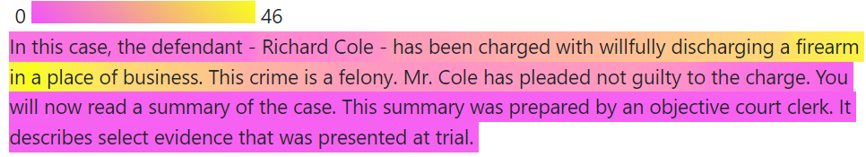

# highlightr <a href="https://rachelesrogers.github.io/highlightr/"></a>


<!-- README.md is generated from README.Rmd. Please edit that file -->

```{r, include = FALSE}
knitr::opts_chunk$set(
  collapse = TRUE,
  comment = "#>",
  fig.path = "man/figures/README-",
  out.width = "100%"
)
```

<!-- badges: start -->
<!-- badges: end -->

This package can be used to create a highlighted source document based on the frequency of phrases found in single or multiple note sheets.
The goal of this method is to indicate the portions of the source document that individuals felt was most worth copying into notes, based on phrase frequency.
The inputs necessary for this procedure are a notes document and a source document.
The output will be HTML code for generating the highlighted text.

## Acknowledgements

This work was funded (or partially funded) by the Center for Statistics and Applications in Forensic Evidence (CSAFE) 
through Cooperative Agreements 70NANB15H176 and 70NANB20H019 between NIST and Iowa State University, which includes activities carried 
out at Carnegie Mellon University, Duke University, University of California Irvine, University of Virginia, West Virginia University, 
University of Pennsylvania, Swarthmore College and University of Nebraska, Lincoln.

## Installation

You can install from CRAN with:

``` r
install.packages("highlightr")
```

You can install the development version of highlightr from [GitHub](https://github.com/) with:

``` r
# install.packages("devtools")
devtools::install_github("rachelesrogers/highlightr")
```


## Example

```{r, message=FALSE}
# load library
library(highlightr)

# rename desired column of derivative documents to 'page_notes'
comment_example_rename <- dplyr::rename(comment_example, page_notes=Notes)

# tokenize derivative documents
toks_comment <- token_comments(comment_example_rename)

# rename desired column of source document to 'text'
transcript_example_rename <- dplyr::rename(transcript_example, text=Text)

# tokenize source document
toks_transcript <- token_transcript(transcript_example_rename)

# use fuzzy matching in collocation
collocation_object <- collocate_comments_fuzzy(toks_transcript, toks_comment)

# connect collocation frequencies to source document
merged_frequency <- transcript_frequency(transcript_example_rename, collocation_object)

# create `ggplot` object of the transcript
freq_plot <- collocation_plot(merged_frequency)

# add html tags to source document
page_highlight <- highlighted_text(freq_plot)

```

```{r results='asis', eval=FALSE}
page_highlight
```
`page_highlight` will produce HTML output that can then be rendered into highlighted text.
This can be done in R Markdown by specifying the object outside of a code chunk as `` `r '\x60r page_highlight\x60'` ``, and knitting the document to HTML.

Alternatively, the `xml2` package can be used to save the output as an html file, as shown in the following code:

```{r, message=FALSE, warning=FALSE, eval=FALSE}

# load `xml2` library

library(xml2)

# save html output to desired location

xml2::write_html(xml2::read_html(page_highlight), "filename.html")

```

The below image is generated through the resulting html output (as seen in the `vignette("highlightr")`).


