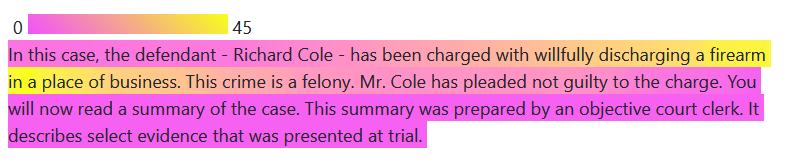

# highlightr <a href="https://rachelesrogers.github.io/highlightr/"></a>

<!-- README.md is generated from README.Rmd. Please edit that file -->
<!-- badges: start -->
<!-- badges: end -->

This package can be used to create a highlighted source document based
on the frequency of phrases found in single or multiple note sheets. The
goal of this method is to indicate the portions of the source document
that individuals felt was most worth copying into notes, based on phrase
frequency. The inputs necessary for this procedure are a notes document
and a source document. The output will be HTML code for generating the
highlighted text.

## Acknowledgements

This work was funded (or partially funded) by the Center for Statistics
and Applications in Forensic Evidence (CSAFE) through Cooperative
Agreements 70NANB15H176 and 70NANB20H019 between NIST and Iowa State
University, which includes activities carried out at Carnegie Mellon
University, Duke University, University of California Irvine, University
of Virginia, West Virginia University, University of Pennsylvania,
Swarthmore College and University of Nebraska, Lincoln.

## Installation

You can install from CRAN with:

``` r
install.packages("highlightr")
```

You can install the development version of highlightr from
[GitHub](https://github.com/) with:

``` r
# install.packages("devtools")
devtools::install_github("rachelesrogers/highlightr")
```

## Example

``` r
library(highlightr)
comment_example_rename <- dplyr::rename(comment_example, page_notes=Notes)
toks_comment <- token_comments(comment_example_rename)
transcript_example_rename <- dplyr::rename(transcript_example, text=Text)
toks_transcript <- token_transcript(transcript_example_rename)
collocation_object <- collocate_comments_fuzzy(toks_transcript, toks_comment)
#> Warning in join_func(a = a, b = b, by_a = by_a, by_b = by_b, block_by_a = block_by_a, : A pair of records at the threshold (0.7) have only a 95% chance of being compared.
#> Please consider changing `n_bands` and `band_width`.
merged_frequency <- transcript_frequency(transcript_example_rename, collocation_object)
freq_plot <- collocation_plot(merged_frequency)
page_highlight <- highlighted_text(freq_plot)
```

``` r
page_highlight
```

`page_highlight` will produce HTML output that can then be rendered into
highlighted text. This can be done in R Markdown by specifying the
object outside of a code chunk as `` `r page_highlight` ``, and knitting
the document to HTML.

The below image is generated through the resulting html output (as seen
in the `vignette("highlightr")`).


